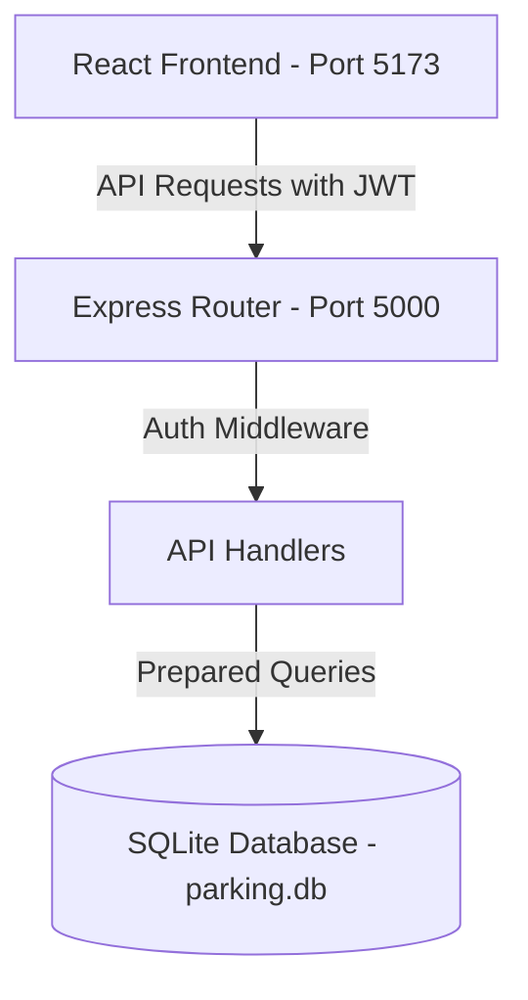

# 🅿️ SmartParking Management System


---

## 🚀 Live Deployments

- **🖥️ Frontend Web App**: [https://parking-management-system-gold.vercel.app/](https://parking-management-system-gold.vercel.app/)
- **⚙️ Backend API Server**: [https://parking-management-system-ozoc.vercel.app/](https://parking-management-system-ozoc.vercel.app/)

---

A full-stack, enterprise-grade Parking Management System designed to handle vehicle slot allocation, entry/exit logs, dynamic tariff calculations, user reservations, and real-time dashboard analytics. Built with **React (Vite)** on the frontend, **Express.js** on the backend, and powered by a **SQLite** database.

---

## 🛠️ Tech Stack & Key Features

### Technology Stack
- **Frontend**: React (v18), Vite, React Router DOM (v6), Tailwind CSS, Lucide React (icons), Axios (HTTP Client), Context API (Auth & Theme)
- **Backend**: Node.js, Express.js (v5), `better-sqlite3` (SQLite engine), JSON Web Token (JWT) for authentication, `bcryptjs` for password hashing
- **Database**: SQLite (local serverless database)

### Core Features
- 🔐 **Dual-Role Authentication**: Admin and User portals with JWT authentication. Administrators require a verification secret (`admin123`) to register.
- 📊 **Real-Time Analytics Dashboard**: Visual analytics showing total, occupied, and available slots, active vehicles inside the facility, and cumulative revenue.
- 🚗 **Automated Slot Allocation**: Smart auto-assignment of the closest available slot matching the vehicle type (Car or Bike) on entry.
- ⏱️ **Dynamic Tariff & Automated Checkout**: Calculates fees on vehicle exit using configurable hourly rates (Minimum charge of 1 hour).
- 📅 **Advanced Reservation System**: Registered users can book slots in advance. Admins can check-in reservations directly (transitioning them to active parking) or cancel bookings.
- ⚙️ **Dynamic Configuration**: Admins can edit hourly parking rates and add or remove parking slots in real time.
- 🌗 **Premium Responsive Design**: Supports dark/light modes out of the box with custom HSL/Tailwind CSS styling and smooth micro-animations.

---

## 🏗️ System Architecture & Folder Structure

### High-Level Components


### Folder Structure
```text
Parking Management System/
├── backend/                  # Node.js + Express Server
│   ├── db/                  # SQLite Database Configuration & Seed Data
│   │   ├── database.js      # DB initialization, schemas & seeder
│   │   └── parking.db       # Active SQLite database file
│   ├── routes/              # Modular Express API Routes
│   │   ├── auth.js          # Auth middleware, Login & Registration
│   │   ├── dashboard.js     # Admin metrics calculations
│   │   ├── parking.js       # Entry, Exit, and active parking records
│   │   ├── rates.js         # Hourly rate configuration
│   │   ├── reservations.js  # Booking, check-ins, and cancellations
│   │   └── slots.js         # Slot addition and removal
│   ├── server.js            # Express entry point
│   ├── package.json         # Backend dependencies & startup scripts
│   └── vercel.json          # Deployment configuration for Vercel Serverless
└── frontend/                 # Vite + React Client
    ├── src/                 # Source code
    │   ├── components/      # Shared components (Layout, Navbar)
    │   ├── context/         # Auth & Theme (Dark/Light) React Contexts
    │   ├── pages/           # Pages (Dashboard, Entry, Exit, Reservations, Slots, Rates, Auth)
    │   ├── App.jsx          # Route Definitions & Error Boundary
    │   ├── index.css        # Global CSS & Tailwind imports
    │   └── main.jsx         # Client mount point
    ├── tailwind.config.js   # Custom styling configuration
    ├── vite.config.js       # Vite bundler options
    └── package.json         # Frontend dependencies & scripts
```

---

## 🗄️ Database Schema & Data Models

The system runs on SQLite with enforced foreign key support (`PRAGMA foreign_keys = ON`).

### 1. `users`
Stores system accounts with credentials and authorization roles.
| Column | Data Type | Constraints | Description |
| :--- | :--- | :--- | :--- |
| `id` | INTEGER | PRIMARY KEY, AUTOINCREMENT | Unique user identifier |
| `name` | TEXT | NOT NULL | User's full name |
| `email` | TEXT | UNIQUE, NOT NULL | Account email (used for login) |
| `password` | TEXT | NOT NULL | Hashed password (Bcrypt) |
| `role` | TEXT | NOT NULL, CHECK(`role` IN ('Admin', 'User')) | Authorization level |

### 2. `slots`
Represents individual parking bays.
| Column | Data Type | Constraints | Description |
| :--- | :--- | :--- | :--- |
| `id` | INTEGER | PRIMARY KEY, AUTOINCREMENT | Bay/Slot identifier number |
| `type` | TEXT | NOT NULL, CHECK(`type` IN ('Car', 'Bike')) | Type of vehicle the slot accommodates |
| `status` | TEXT | DEFAULT 'Available', CHECK(`status` IN ('Available', 'Occupied')) | Current occupancy state |

### 3. `parking_records`
Logs history of all vehicle entries, exits, and fees.
| Column | Data Type | Constraints | Description |
| :--- | :--- | :--- | :--- |
| `id` | INTEGER | PRIMARY KEY, AUTOINCREMENT | Unique transaction log ID |
| `vehicle_number` | TEXT | NOT NULL | License plate number |
| `slot_id` | INTEGER | NOT NULL, FOREIGN KEY -> `slots.id` (RESTRICT) | Slot occupied by the vehicle |
| `entry_time` | DATETIME | DEFAULT CURRENT_TIMESTAMP | Date & time vehicle entered |
| `exit_time` | DATETIME | NULLABLE | Date & time vehicle checked out |
| `fee` | REAL | NULLABLE | Total calculated fee based on duration |

### 4. `rates`
Configures hourly rates dynamically based on vehicle type.
| Column | Data Type | Constraints | Description |
| :--- | :--- | :--- | :--- |
| `vehicle_type` | TEXT | PRIMARY KEY, CHECK(`vehicle_type` IN ('Car', 'Bike')) | Vehicle Category |
| `hourly_rate` | REAL | NOT NULL | Rate per hour (currency units) |

### 5. `reservations`
Manages pre-booked parking bays for registered users.
| Column | Data Type | Constraints | Description |
| :--- | :--- | :--- | :--- |
| `id` | INTEGER | PRIMARY KEY, AUTOINCREMENT | Booking reference code |
| `user_id` | INTEGER | NOT NULL, FOREIGN KEY -> `users.id` (CASCADE) | User who made the booking |
| `vehicle_number`| TEXT | NOT NULL | Scheduled license plate |
| `vehicle_type` | TEXT | NOT NULL, CHECK(`vehicle_type` IN ('Car', 'Bike')) | Vehicle Category |
| `slot_id` | INTEGER | NOT NULL, FOREIGN KEY -> `slots.id` (RESTRICT) | Target booked slot |
| `reservation_time`| DATETIME| NOT NULL | Booked appointment time |
| `status` | TEXT | DEFAULT 'Pending', CHECK(`status` IN ('Pending', 'CheckedIn', 'Cancelled')) | Booking state |

---

## 🔌 API Endpoints Reference

All API routes are prefixed with `/api`. Protected routes require a JSON Web Token passed in the request header as `Authorization: Bearer <TOKEN>`.

### Authentication (`/api/auth`)
*   `POST /api/auth/register`: Create a new account.
    *   **Body**: `{ "name", "email", "password", "role", "admin_secret_key" }` *(secret required only for role='Admin')*
*   `POST /api/auth/login`: Authenticate credentials.
    *   **Body**: `{ "email", "password" }`
    *   **Response**: `{ "token", "user": { "id", "name", "email", "role" } }`

### Parking Slots (`/api/slots`)
*   `GET /api/slots` *(Protected)*: Fetch a list of all slots.
*   `POST /api/slots` *(Protected - Admin Only)*: Add a new parking slot.
    *   **Body**: `{ "type": "Car" | "Bike" }`
*   `DELETE /api/slots/:id` *(Protected - Admin Only)*: Delete a slot by ID (fails if slot is occupied or has a pending reservation).

### Parking Transactions (`/api/parking`)
*   `POST /api/parking/entry` *(Protected)*: Park a vehicle (automatically assigns closest slot).
    *   **Body**: `{ "vehicle_number", "type": "Car" | "Bike" }`
*   `POST /api/parking/exit` *(Protected)*: Check-out a vehicle, release slot, and calculate tariff.
    *   **Body**: `{ "vehicle_number" }`
*   `GET /api/parking/active` *(Protected)*: Retrieve all currently parked vehicles.

### Tariff Rates (`/api/rates`)
*   `GET /api/rates` *(Protected)*: View hourly rates for all vehicle types.
*   `PUT /api/rates` *(Protected - Admin Only)*: Update rates.
    *   **Body**: `{ "rates": { "Car": <value>, "Bike": <value> } }`

### Bookings & Reservations (`/api/reservations`)
*   `GET /api/reservations` *(Protected)*: Get user reservations (Admins see all reservations).
*   `POST /api/reservations` *(Protected)*: Create a new reservation.
    *   **Body**: `{ "vehicle_number", "vehicle_type", "slot_id", "reservation_time" }`
*   `POST /api/reservations/:id/checkin` *(Protected)*: Check-in a reserved vehicle (converts to active parking).
*   `POST /api/reservations/:id/cancel` *(Protected)*: Cancel a pending reservation.

### Dashboard Stats (`/api/dashboard`)
*   `GET /api/dashboard` *(Protected)*: Fetch aggregate facility metrics (`totalSlots`, `occupiedSlots`, `availableSlots`, `activeVehicles`, `totalRevenue`).

---

## ⚡ Setup & Installation

### Prerequisites
- Node.js installed (v16.x or newer is recommended)
- NPM or Yarn package manager

### 1. Configure the Backend
Navigate to the backend directory, install the required packages, and start the API server:
```bash
# Navigate to backend
cd backend

# Install dependencies
npm install

# (Optional) Create a .env file to customize settings
# PORT=5000
# JWT_SECRET=your_custom_jwt_secret_key
# VERCEL=0

# Start server
npm start
```
*The database file `parking.db` is pre-configured and will automatically run seed scripts on startup to create default tables and demo entries if they do not exist.*

### 2. Configure the Frontend
Navigate to the frontend directory, install the packages, and run the hot-reloading development server:
```bash
# Navigate to frontend
cd ../frontend

# Install dependencies
npm install

# Start Vite dev server
npm run dev
```
Open [http://localhost:5173](http://localhost:5173) in your browser.

---

## 🔑 Demo & Seeding Credentials

Upon first initialization, the backend initializes the SQLite database and seeds default accounts and sample data:

### 1. Default Accounts
*   **Administrator Account**:
    *   **Email**: `sweet@gmail.com`
    *   **Password**: `queen`
*   **Standard Customer Account**:
    *   **Email**: `user@gmail.com`
    *   **Password**: `user123`

### 2. Default Facility Configuration
*   **Hourly Rates**: Car = `50` units/hr | Bike = `20` units/hr
*   **Parking Capacity**: 8 Car slots (Slots 1–8) and 6 Bike slots (Slots 9–14)
*   **Sample Data**:
    *   1 Active Reservation TN-01-AB-1234 (Car, Pending)
    *   1 Checked-In Reservation TN-02-XY-9876 (Bike, Slot 10)
    *   1 Independent Active Vehicle TN-09-QQ-7777 (Car, Slot 1)

---

## 🔄 User Workflows & Operation

### 1. Registering an Administrator
When clicking **Register** on the navbar, choose the role **Admin**. A secret key input will appear. Enter **`admin123`** to authorize admin status.

### 2. Vehicle Entry (Manual Entry or Booking Check-in)
- **Direct Entry**: Go to the **Vehicle Entry** page, key in the license plate, select the vehicle type, and click **Park Vehicle**. The system queries the database for the lowest available index slot matching that type, updates the slot state to `Occupied`, and creates an entry record.
- **Reservation Entry**: Go to the **Reservations** page. Locate the pending booking, and click **Check In**. This automatically transitions the booking status to `CheckedIn`, marks the assigned slot occupied, and opens an active parking transaction log.

### 3. Vehicle Exit (Fee Computation)
Go to the **Vehicle Exit** page, search for the vehicle plate number, and submit. The system:
1. Calculates the elapsed time (`exit_time - entry_time`).
2. Rounds up fractional hours to the nearest whole number (minimum 1 hour).
3. Fetches the vehicle type's hourly rate from the database.
4. Multiplies hours by rate to output the final fee.
5. Updates the slot status to `Available` and records checkout information.

### 4. Dynamic Slots & Rates (Admin Portal)
- Go to the **Slots** page to see all bays. Add a new slot by selecting a type or delete unoccupied slots.
- Go to the **Rates** page to change hourly costs. Modifying rates immediately adjusts fee calculations for all exits processed after the change.

---

## 📄 License

Distributed under the ISC License. See `backend/package.json` for licensing details.
